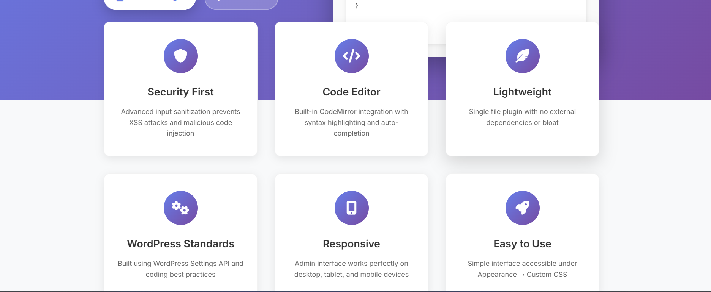
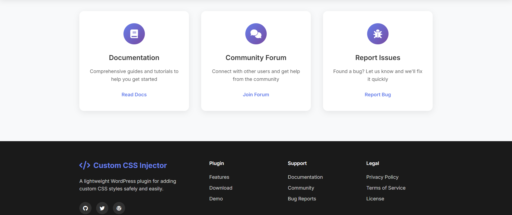
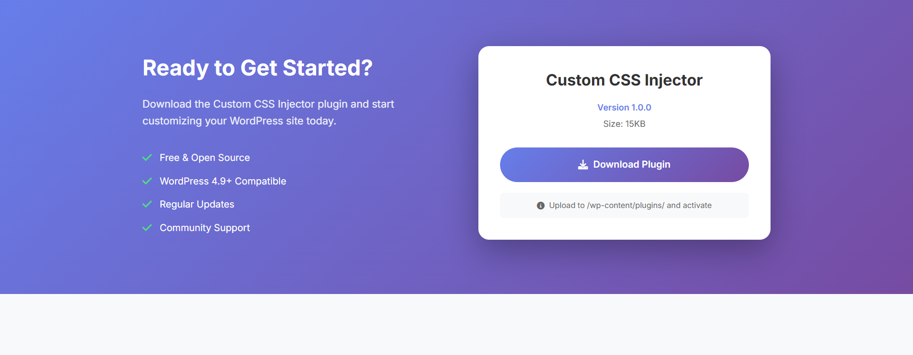

# Custom CSS Injector

A professional WordPress plugin that enables site administrators to add custom CSS styles directly from the WordPress admin dashboard without modifying theme files.


## Overview

Custom CSS Injector provides a secure and user-friendly interface for adding custom CSS to WordPress websites. Built with WordPress best practices and modern web standards, this plugin offers a comprehensive solution for site customization without the risks associated with direct theme file modification.

## Key Features

### Administrative Interface
- Dedicated admin page under Appearance menu
- Enhanced code editor with syntax highlighting
- Real-time CSS validation and error reporting
- Intuitive user interface with helpful guidance

### Security & Performance
- Advanced input sanitization and validation
- XSS attack prevention mechanisms
- Lightweight architecture with minimal resource usage
- WordPress Settings API integration for secure data handling

### Developer-Friendly
- Extensible plugin architecture
- WordPress coding standards compliance
- Comprehensive hook system for customization
- Clean, well-documented codebase



## Installation

### Method 1: Manual Installation
1. Download the `custom-css-injector.php` file from the repository
2. Upload the file to your WordPress installation's `/wp-content/plugins/` directory
3. Navigate to the WordPress admin area and go to Plugins > Installed Plugins
4. Locate "Custom CSS Injector" in the plugin list and click "Activate"

### Method 2: WordPress Admin Upload
1. In your WordPress admin, navigate to Plugins > Add New
2. Click "Upload Plugin" at the top of the page
3. Choose the `custom-css-injector.php` file and click "Install Now"
4. After installation completes, click "Activate Plugin"

## Configuration and Usage

### Accessing the Plugin
After activation, navigate to **Appearance > Custom CSS** in your WordPress admin dashboard.



### Adding Custom Styles
1. Enter your CSS code in the provided textarea editor
2. Utilize the syntax highlighting and auto-completion features
3. Click "Save CSS" to apply your changes
4. View your website frontend to see the applied styles

### Example Implementation

```css
/* Site-wide typography enhancement */
body {
    font-family: 'Helvetica Neue', Arial, sans-serif;
    line-height: 1.6;
    color: #333333;
}

/* Header customization */
.site-header {
    background: linear-gradient(135deg, #667eea 0%, #764ba2 100%);
    padding: 20px 0;
}

/* Button styling */
.custom-button {
    background-color: #007cba;
    color: #ffffff;
    padding: 12px 24px;
    border: none;
    border-radius: 6px;
    cursor: pointer;
    transition: background-color 0.3s ease;
}

.custom-button:hover {
    background-color: #005a87;
}

/* Responsive design considerations */
@media (max-width: 768px) {
    .site-header {
        padding: 15px 0;
    }
}
```

## Security Implementation

### Input Validation
- Comprehensive sanitization of all user input
- Removal of potentially malicious code patterns
- JavaScript and script tag filtering
- Protection against CSS injection attacks

### Access Control
- Restricted access to users with `manage_options` capability
- WordPress nonce verification for form submissions
- Secure data storage using WordPress Options API

### Code Safety
- Removal of `@import` statements to prevent external resource loading
- Filtering of dangerous CSS functions and expressions
- Prevention of inline JavaScript execution



## Technical Specifications

### System Requirements
- **WordPress Version**: 4.9 or higher (CodeMirror support required)
- **PHP Version**: 7.0 or higher
- **MySQL Version**: 5.6 or higher
- **Server Requirements**: Standard WordPress hosting environment

### Architecture Details
- **Database Storage**: WordPress Options API
- **Frontend Integration**: `wp_head` action hook
- **Admin Integration**: WordPress Settings API
- **Code Editor**: WordPress built-in CodeMirror implementation

### Performance Characteristics
- **Plugin Size**: Approximately 15KB
- **Database Impact**: Single option entry
- **Frontend Load**: Minimal CSS output in document head
- **Admin Load**: CodeMirror assets loaded only on plugin page

## Customization and Extension

### Available Hooks
The plugin provides several action and filter hooks for developers:

```php
// Modify CSS before output
add_filter('custom_css_injector_output', 'your_custom_function');

// Add custom validation rules
add_filter('custom_css_injector_validate', 'your_validation_function');

// Extend admin interface
add_action('custom_css_injector_admin_page', 'your_admin_function');
```

### Plugin Extension Examples
- Custom CSS preprocessing
- Additional validation rules
- Integration with theme customizer
- Multi-site network support

## Best Practices

### Development Workflow
- Test all CSS changes in a staging environment
- Use browser developer tools for initial testing
- Implement specific selectors to avoid theme conflicts
- Document custom styles with inline comments

### Performance Optimization
- Minimize CSS output size
- Use efficient selectors
- Avoid excessive use of `!important` declarations
- Consider mobile-first responsive design approaches

### Maintenance Guidelines
- Regular backup of custom CSS code
- Version control for significant changes
- Periodic review of applied styles
- Compatibility testing with theme updates

## Troubleshooting

### Common Issues and Solutions

**Custom CSS not appearing on frontend**
- Verify plugin activation status
- Check user permissions (Administrator role required)
- Clear website and browser caches
- Inspect page source for `<style id="custom-css-injector-styles">` tag

**Admin interface not accessible**
- Confirm user has `manage_options` capability
- Check for plugin conflicts by temporarily deactivating other plugins
- Verify WordPress version compatibility
- Review server error logs for PHP errors

**CSS not saving properly**
- Check for JavaScript errors in browser console
- Verify form submission is completing successfully
- Ensure adequate server memory and execution time limits
- Test with simplified CSS code to isolate issues

## Support and Documentation

### Getting Help
- Review this documentation thoroughly
- Check the WordPress.org plugin support forums
- Submit detailed bug reports with system information
- Provide specific examples when requesting assistance

### Contributing
- Report bugs and security issues responsibly
- Suggest feature enhancements with use cases
- Submit code improvements following WordPress standards
- Help improve documentation and user guides

## License and Legal

This plugin is released under the GNU General Public License v2 or later. You are free to use, modify, and distribute this software in accordance with the GPL license terms.

### Third-Party Components
- CodeMirror integration utilizes WordPress core implementation
- Font Awesome icons used under SIL Open Font License
- No external dependencies or premium components required

## Changelog

### Version 1.0.0
- Initial release
- Core CSS injection functionality
- WordPress Settings API integration
- CodeMirror editor implementation
- Security validation system
- Responsive admin interface

---

**Plugin URI**: http://127.0.0.1:5500/index.html  
**Author**: Custom CSS Injector Team  
**Version**: 1.0.0  
**Tested up to**: WordPress 6.4  
**License**: GPL v2 or later